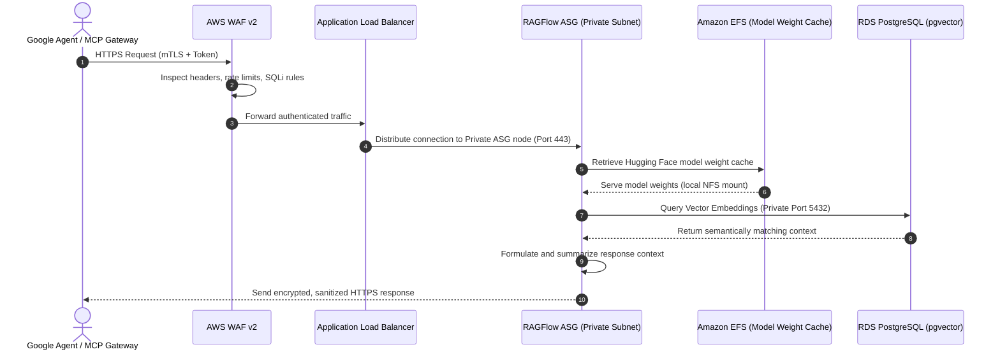

**[DEVOPS EXECUTION]**

# System Architecture

This document describes the high-availability 3-tier network topology, AWS component layouts, and routing architectures deployed by this project, fully aligned with our **[Estimated Costing](costing.html)** model.

Additionally, this architecture is fully customized to map and host the **Developer's First Design (PHP CodeIgniter Web Application)** in a secure, highly-available, and resilient manner, built using hardened **Nginx + PHP-FPM** nodes on **Ubuntu 26.04 LTS** or **Amazon Linux 2023** and integrated with **Amazon ElastiCache for Valkey**.

---

## Developer's First Design vs. AWS Production Architecture

In the developer's initial design, the application was structured across three separate standalone virtual machine servers:
- **Server 01 (Web Server):** Nginx Web Server / Reverse Proxy (2 vCPU, 4GB RAM)
- **Server 02 (App Server):** PHP & CodeIgniter Execution Engine (4 vCPU, 16GB RAM)
- **Server 03 (Database Server):** SQL Database (4 vCPU, 16GB RAM)

While simple, deploying this directly as separate standalone VMs introduces single points of failure (SPOF), security vulnerabilities from direct public internet exposure, manual backup overhead, and a lack of scalability.

To make this suitable for enterprise AWS deployment **without changing the AWS requirements**, we have mapped each of these components directly to a secure, multi-AZ, managed 3-tier architecture:

### Architectural Comparative Mapping

| Developer's Original Server | Original Spec | AWS Production-Ready Component | AWS Architectural Benefits |
| :--- | :--- | :--- | :--- |
| **Server 01 & 02: Web/App Server** | 4 vCPU, 16GB RAM, Ubuntu | **AWS WAFv2 + ALB + Private Nginx & PHP-FPM ASG & Dedicated Standalone Instance** | **No Public IPs & Local Baking Parity:** Traffic enters via secure ALB/WAF. Private Nginx + PHP-FPM instances run inside private subnets without public IPs. Paired with a dedicated Standalone instance to test configurations and pre-bake custom CodeIgniter `ami-php-*` images. Hardened via **ASIMP**. |
| **Server 03: Database** | 4 vCPU, 16GB RAM, Ubuntu | **AWS RDS Database (Multi-AZ) & Amazon ElastiCache for Valkey** | **Managed Resiliency & Enterprise Caching:** Replaced self-managed SQL database with a fully managed Multi-AZ Database (`db.m6g.xlarge`). Synchronous replication, automated snapshots/failover, zero direct public route, and ingress restricted solely to private compute instances. Paired with a secure **Amazon ElastiCache for Valkey** cluster inside the database subnets to act as a high-performance in-memory session and cache store for CodeIgniter, reducing database overhead. |

---

## Standalone EC2 Instances for AMI Creation and Parity

To ensure seamless, reliable updates and zero-downtime rolling upgrades across our Auto Scaling Groups (ASGs), the application group is paired with a dedicated **Standalone EC2 Instance** (running **Ubuntu 26.04 LTS** and hardened via the **ASIMP** framework).

These standalone instances are deployed directly inside the secure **VPC Private Application Subnets** and are configured to connect to the exact same shared resources (AWS RDS Database, Amazon S3 Buckets, and Amazon ElastiCache Valkey caching) as their corresponding ASGs:

1. **Standalone Staging / Developer Instance:**
   - Connected to **Amazon S3** to manage and verify static assets or remote template files.
   - Connected to the **Multi-AZ RDS Database** (using identical DB endpoints and credentials), **Amazon S3** (using identical IAM Role permissions), and **Amazon ElastiCache Valkey** (port 6379).
   - Used to test Nginx routing/configurations, run CodeIgniter migrations, and verify application updates before baking the `ami-php-*` image under a 1:1 replica environment.

### Architectural Advantages of Standalone-to-AMI Parity:
- **1:1 Environment Alignment:** Because each standalone instance connects to the exact same database, Valkey cache, and shared storage backends, developers can fully run, test, and validate configurations in a real production-like environment without any risk of deployment divergence.
- **Pre-Audited & Hardened Base:** Standalone instances serve as the staging template. Developers run the **ASIMP** auditing and hardening pipelines directly on these instances, verifying system integrity reports before triggering the Packer/AMI capture.
- **Zero-Downtime Releases:** Once the standalone instance is verified and the AMI is baked, updating the ASG Launch Template and running an Instance Refresh executes a safe rolling update across the live cluster.

---

## Architectural Schematic


The updated network topology below outlines how our ASG application group and its matching standalone AMI-baking instance connect to the shared database, Amazon S3, and ElastiCache Valkey within our AWS secure environment:

```text
                                            [ INTERNET ] (Web Client)
                                                 │
                                                 ▼ (HTTPS: app.linuxmalaysia.com)
                                           [ Route 53 ]        <-- DNS Management & Alias Routing
                                                 │
                                                 ▼
                                           [ AWS WAFv2 ]       <-- Layer 7 Security (Core Rules, Rate Limiting)
                                                 │
                                                 ▼ (HTTPS)
                                  [ Application Load Balancer ] <-- Public Subnets (ap-southeast-5a/5b)
                                                 │
                    ┌────────────────────────────┴────────────────────────────┐
                    │ (Public Subnet area)                                    │
                    │                                                         │
                    │            [ AWS NAT Gateways ]                         │
                    │            (Outbound Secure Egress)                     │
                    └────────────────────────────┬────────────────────────────┘
                                                 │
                                                 ▼ (HTTPS Outbound Routing)
         ┌─────────────────────────────────────────────────────────────────────────────────────┐
         │                          VPC PRIVATE APPLICATION SUBNETS                            │
         │                                                                                     │
         │  ┌──────────────────────┐                                 ┌──────────────────────┐  │
         │  │   CODEIGNITER ASG    │                                 │    PHP STANDALONE    │  │
         │  │ (Nginx + PHP-FPM)    │                                 │  (AMI Baker/Staging) │  │
         │  │   • Sizing: t4g.med  │                                 │  • Sizing: t4g.micro │  │
         │  └──────────┬───────────┘                                 └──────────┬───────────┘  │
         │             │                                                        │              │
         │             ├────────────────────────────────────────────────────────┤              │
         │             ▼ (Secure API Outbound Call / Read / Write)               ▼              │
         │                               [ S3 Bucket ]                                         │
         │                            [ (Shared Objects)]                                      │
         └──────────────────────────────────────┬───────────────────────────────┬──────────────┘
                                                │ (SQL Protocol)                │ (SQL Protocol)
                                                │ (Valkey Protocol)             │ (Valkey Protocol)
                                                ▼                               ▼
         ┌─────────────────────────────────────────────────────────────────────────────────────┐
         │                           VPC PRIVATE DATABASE SUBNETS                              │
         │                                                                                     │
         │  ┌───────────────────────────────────────────────────────────────────────────────┐  │
         │  │                    MULTI-AZ RDS DATABASE (MYSQL / POSTGRESQL)                 │  │
         │  │                                                                               │  │
         │  │   ┌───────────────────────────────────┐   ┌───────────────────────────────────┐   │  │
         │  │   │     Primary DB (ap-southeast-5a)  │   │     Standby DB (ap-southeast-5b)  │   │  │
         │  │   │                                   │   │     (Synchronous Replication)     │   │  │
         │  │   │  • Server 03: Database Data Tier  │═══»                                   │   │  │
         │  │   │  (Sizing: db.m6g.xlarge, gp3)     │   │  (Automatic Failover Target)      │   │  │
         │  │   └───────────────────────────────────┘   └───────────────────────────────────┘   │  │
         │  └───────────────────────────────────────────────────────────────────────────────┘  │
         │                                                                                     │
         │  ┌───────────────────────────────────────────────────────────────────────────────┐  │
         │  │                    AMAZON ELASTICACHE FOR VALKEY CLUSTER                      │  │
         │  │                                                                               │  │
         │  │   • Port: 6379 (Secure Private Access Only)                                   │  │
         │  │   • Sizing: cache.t4g.micro (Baseline) / cache.t4g.medium (High-Performance)     │  │
         │  │   • Ingress restricted to Private Compute ASG and Standalone Instances        │  │
         │  │   • TLS/SSL In-Transit and At-Rest Encryption Enforced                        │  │
         │  └───────────────────────────────────────────────────────────────────────────────┘  │
         └─────────────────────────────────────────────────────────────────────────────────────┘
```

---

## AI Agent Data Flow & Zero-Trust Integration

To enable elite external AI agents (**Google Antigravity** and **Google Jules**) to securely traverse our 3-tier architecture and query localized databases without bypassing zero-trust boundaries, we have integrated a dedicated, secure data pathway.

All context retrieval, document scanning, and vector queries flow through private subnets and are restricted by strict regional constraints.

### 1. End-to-End Handshake & Network Traversal Path

When an external agent initiates a query, the request traverses the AWS 3-tier layout along the following end-to-end path:

$$\text{Google Agent / MCP Gateway} \longrightarrow \text{AWS WAF v2 / ALB} \longrightarrow \text{RAGFlow ASG (Private Subnet)} \longrightarrow \text{RDS PostgreSQL (pgvector) / EFS Model Cache}$$



### 2. Private Subnet Isolation & Shared EFS Caching
- **Hugging Face Weight Storage:** The Nginx + PHP-FPM / RAGFlow nodes run in isolated private subnets. During live queries, heavy model weights are loaded dynamically from a shared, highly-available **Amazon Elastic File System (EFS)** mount. This localizes weight loading and ensures low-latency execution under concurrency load.
- **VPC Port Protection:** No database or EFS ports are exposed to the public internet. Access is restricted purely to application servers via security group chainings.
- **PDPA Alignment:** All operations take place in the local region (`ap-southeast-5`), preventing the unauthorized cross-border export of citizen PII data. For detailed security specifications, refer to our comprehensive **[AI Agent Data Flow & Zero-Trust Handshake Guide](ragflow-langfuse.html)**.

---


## Network Isolation Layers


### 1. Presentation / Web Layer (Public Subnets)


- **Subnets:** `10.0.1.0/24` (AZ `ap-southeast-5a`) and `10.0.2.0/24` (AZ `ap-southeast-5b`).
- **Description:** Hosts public-facing services and manages secure domain mappings. This layer routes inbound internet traffic directly through the Internet Gateway (IGW).
- **Resources:**
  - **Route 53 DNS Routing:** Manages custom domain delegations and points A Alias records to the ALB. Integrated with AWS Certificate Manager (ACM) for automatic domain verification.
  - **Application Load Balancer (ALB):** Terminates and routes incoming connections. Replaces the external Nginx reverse proxy direct exposure (from Server 01), dispersing HTTP/HTTPS traffic to private instances.
  - **NAT Gateway:** A highly-available NAT Gateway deployment in public subnets provides secure outbound internet access for package retrieval and API callbacks.
  - **AWS WAFv2 Web ACL:** Directly attached to the ALB with 3 rules (OWASP Core, SQLi, and IP Rate Limiting) to block bad actors at the edge.


### 2. Application Layer (Private Subnets)


- **Subnets:** `10.0.10.0/24` (AZ `ap-southeast-5a`) and `10.0.11.0/24` (AZ `ap-southeast-5b`).
- **Description:** Holds business and compute logic. Instances have no public IP addresses and cannot be accessed directly from the internet.
- **Resources:**
  - **Auto Scaling Group (ASG) EC2 Instances:** Hosts the application code (Nginx web service + PHP-FPM). Features **t4g.medium** or **t4g.xlarge** EC2 Instances (ARM Graviton) equipped with **gp3 EBS Root Volumes**. They handle Nginx + PHP-FPM workloads securely on hardened Ubuntu 26.04 LTS or Amazon Linux 2023.
  - **Standalone EC2 Instances:** Deploys a dedicated standalone instance inside the private subnets. This instance is connected to the exact same shared databases (RDS), caches (Valkey), and storage systems (S3) as the ASG, acting as a 1:1 replica environment for application staging, testing, ASIMP auditing/hardening, and pre-baking custom AMIs.


### 3. Database & Caching Layer (Isolated Private Subnets)


- **Subnets:** `10.0.20.0/24` (AZ `ap-southeast-5a`) and `10.0.21.0/24` (AZ `ap-southeast-5b`).
- **Description:** Dedicated to database servers and caching nodes. Deeply isolated without any outbound route to the internet or NAT gateways, minimizing any data extraction surface.
- **Resources:**
  - **Multi-AZ RDS Database Instance:** Runs synchronously across multiple availability zones using **Multi-AZ `db.m6g.xlarge`** with **gp3 Storage**, corresponding to the developer's resource needs. This guarantees high-availability, automatic failover, and robust production database performance.
  - **Amazon ElastiCache for Valkey Cluster:** A secure, high-performance in-memory caching cluster running Valkey 7.2. It manages session state and caches database queries for CodeIgniter. It operates on port `6379` with transit and at-rest encryption enabled, allowing ingress only from private compute security groups.


### 4. Storage Tier (Amazon S3)


- **Description:** Statically hosted media, secure user uploads, and build backups. It is situated outside the VPC but fully integrated.
- **Resources:**
  - **Amazon S3 Bucket:** Fully encrypted standard object storage. Access is managed via IAM policies and secure credentials.

---


## Routing Configuration


The architecture manages network traffic flow through three distinct route tables:


### Public Route Table


- Associated with public subnets.
- Routes all outbound traffic (`0.0.0.0/0`) to the **Internet Gateway (IGW)**.


### Private Application Route Table


- Associated with private application subnets.
- Routes all outbound traffic (`0.0.0.0/0`) to the **NAT Gateway** running in the public subnet. (Outbound secure routes map from private subnets to public NAT instances).


### Database Route Table


- Associated with private database subnets.
- Contains only local VPC route entries (`10.0.0.0/16`), ensuring database and cache traffic never traverses public routes or internet gateways.
