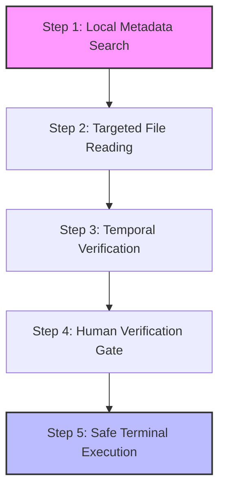

**[SECURITY & COMPLIANCE]**

# ASIMP for AI Agents: Cognitive Twin Integration & Persistent Memory Guide

This guide details how the **Ansible System Integrity Management Platform (ASIMP)** is integrated with autonomous AI Agents (such as **Google Jules** and **Google Antigravity**) using the **Deep State of Mind (DSOM)** framework.

By adhering to DSOM principles, AI Agents operating within this repository can execute, audit, and remediate system-level hardening states without experiencing context amnesia, token bloat, or executing risky remote actions without explicit authorization.

---

## 1. Executive Summary & Core Philosophy

In legacy operations, executing systems automation (like Ansible) or host-level security audits (like Lynis and OpenSCAP) required a human operator or a blind script. For autonomous AI agents, executing these tasks introduces two major constraints:
1. **Context Window Amnesia:** The agent forgets past execution results, remediated files, or system decisions across chat reboots.
2. **Token Bloat:** Ingesting raw system logs or full playbooks wastes thousands of tokens, causing high API costs and slowing down response times.

**ASIMP for AI Agents** solves these constraints by implementing a **Cognitive Twin / Persistent Memory Architecture** following the DSOM protocol. Instead of keeping execution states inside ephemeral chat history, ASIMP externalises mental states and operational ledgers into the local filesystem.

---

## 2. Spatial Memory Anchors (`.agents/brain/` & Gateway)

To operate safely and securely, the AI Agent initializes its spatial memory by reading three cascading anchors before any action is executed:

```text
[ Gateway: AGENTS.md ] ──▶ [ Constitution: .agents/AGENTS.md ] ──▶ [ Active Context: .agents/brain/active_context_manifest.md ]
```

### 1. Root Gateway (`AGENTS.md`)
The root-level `AGENTS.md` acts as the entry gateway for external AI crawler crawlers or local editors (such as Cursor or Claude Desktop) scanning the repository. It defines high-level constraints, layout maps, and immediately redirects the agent to the main constitution.

### 2. Sovereign Master Constitution (`.agents/AGENTS.md`)
The master constitution contains the **27 Core Constitutional AI Laws** that govern agent behaviour. For security auditing and ASIMP, the most critical laws are:
- **Rule 1 (Zero-Global Memory):** The agent's session memory must reside strictly in `.agents/brain/` and the universal ledgers, not in the ephemeral chat.
- **Rule 20 (Local Knowledge-First Discovery):** The agent must query local documentation first to identify parameters before querying remote environments or running live check commands.
- **Rule 21 (Temporal Verification Gate):** Every action requires checking the document's OKF timestamp and presenting a structured delta comparison if local specs are outdated.

### 3. Spatial Memory Directory (`.agents/brain/`)
The `.agents/brain/` folder acts as the physical database of the agent's mental state.
- **`active_context_manifest.md`:** This is the Single Source of Truth (SSOT) listing active session focuses, loaded contexts, and checklist checkpoints. To remain fully synchronised, the agent must update this manifest at the end of every turn.

---

## 3. The 5-Step Local Knowledge-First Discovery Protocol

When an AI Agent is tasked with validating or modifying the security hardening of the compute tier (e.g., verifying Lynis audits, tweaking SSH configuration, or applying sysctl policies), it **MUST NOT** run live commands or terminal probes immediately.

Instead, the agent follows the **5-Step Local Knowledge-First Discovery Flow**:



1. **Step 1: Local OKF Search:** The agent searches local OKF frontmatter (`topics:` / `description:`) in `.agents/brain/` and `docs/` using fast keyword grepping.
2. **Step 2: Targeted File Reading:** The agent reads only the matched files using specific line ranges to prevent loading massive text bodies.
3. **Step 3: Temporal Verification:** The agent inspects the document `timestamp` field. If stale or suspected to be outdated, the agent researches external authoritative specifications (such as CIS benchmarks or OpenTofu release notes) and computes a structured delta comparison.
4. **Step 4: Human Verification Gate:** The agent presents the delta to the human operator and seeks explicit confirmation before performing any write operations or state changes.
5. **Step 5: Safe Terminal Execution:** Once authorized, the agent executes local Python helper tools, Ansible playbooks, or OpenTofu validations in the terminal using byte-capped limits (e.g., capping outputs to `head -c 4000`) to prevent context flooding.

---

## 4. Token Performance & Progressive Disclosure

To maintain optimal latency and extreme cost efficiency (98%+ token reduction), ASIMP for AI Agents implements the following structural concepts:

### Semantic Skill Routing
Instead of loading all automation playbooks and custom agent skills into the context window, skills are registered with lightweight OKF v0.1 headers. The AI agent only fetches the full `.md` payload at the exact moment of execution.

### The Artifact Pyramid
Knowledge in ASIMP is stratified into three distinct levels:
- **L1 (Synthesis):** Executive summaries and unified scorecards (e.g., `asimp-output.md` showingLynis Hardening Index vs. OpenSCAP CIS % side-by-side).
- **L2 (Analysis):** Specific audit output reports (`lynis-output.md` and `openscap-output.md` highlighting specific rule IDs and OVAL checks).
- **L3 (Raw Logs):** Raw JSON baseline outputs and command traces (e.g., `/var/log/asimp-baseline-scores.json`).

The agent resolves tasks by querying L1 first, cascading down to L2 or L3 only when specific rule details are missing. Each parent document pairs target links with single-line semantic descriptions, allowing the agent to predict relevance instantly.

---

## 5. Step-by-Step Implementation Sequence of ASIMP with DSOM

When an AI Agent is initiated to perform a security verification using ASIMP, it executes the following chronological lifecycle sequence:

### Phase 1: Cognitive Boot & Reanimation
1. **Initialize Constitution:** The agent scans `AGENTS.md` and reads the full Sovereign Master Constitution (`.agents/AGENTS.md`).
2. **Load Spatial Memory:** The agent reads `.agents/brain/active_context_manifest.md` to load the previous session's checkpoints and task statuses.
3. **Establish Persona:** The agent aligns its behaviour with the elite Systems Engineer persona (written strictly in UK English).

### Phase 2: Local Discovery & Analysis
4. **Metadata Crawl:** The agent searches the `topics` array for keyword matching (e.g. `["security", "compliance", "audit"]`).
5. **Scorecard Parsing:** The agent reads `docs/engineering/asimp-output.md` to parse the unified Dual-Engine Compliance Scorecard:
   ```text
   ========================================================================
                    ASIMP SECURITY HARDENING REPORT
   ========================================================================
   Tool       | Baseline (Min) | Before Hardening | After Hardening | Target
   ------------------------------------------------------------------------
   Lynis HI   | 75             | 62               | 88               | 85+
   OpenSCAP % | 75.0%          | 58.4%            | 91.2%            | 90%+
   ========================================================================
   ```
6. **Rule ID Extraction:** The agent parses individual audit files (e.g. `lynis-output.md` and `openscap-output.md`) to extract target security rule IDs (e.g., `xccdf_org.ssgproject.content_rule_sshd_disable_root_login` or `WARNING-NET-01`).

### Phase 3: Temporal Verification & Human Gate
7. **Timestamp Check:** The agent compares the file modification timestamps.
8. **Structured Delta:** If external benchmarks have updated, the agent formats a structured comparative report and pauses execution to ask for human permission via the `request_user_input` flow.

### Phase 4: Execution & State Sync
9. **Execution Trigger:** Once approved, the agent executes local Python or shell scripts (e.g., `python3 scripts/prepare_docs.py` or the OpenTofu validation suite).
10. **State Compaction:** The agent compacts the updated mental state and writes a new timestamped entry back to `.agents/brain/active_context_manifest.md`.
11. **GitOps Resolution:** The agent commits and pushes changes using target Git merge diff blocks, maintaining a clean, granular history log.

---

## 6. Verification and Audit Ledger

To guarantee the integrity of the DSOM memory palace, all modifications must be continuously audited. The agent runs `python3 -m unittest discover -s tests` to execute static analysis on Ansible configurations, verify sitemap indices, and assert that all Markdown documents strictly comply with the OKF YAML standards.

By pairing structured local discovery with persistent spatial memory, AI Agents can scale complex security engineering operations autonomously and cost-effectively.

---
*Deep State of Mind (DSOM) For My AI Protocol | Harisfazillah Jamel (LinuxMalaysia) | 2026-08-12*
