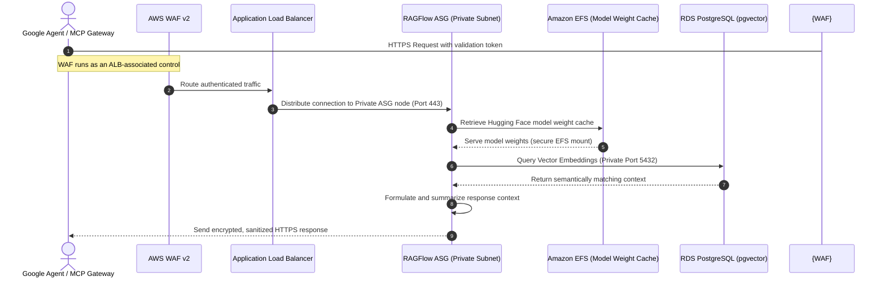

**[SECURITY & COMPLIANCE]**

# AI Agent Data Flow, EFS Model Caching, & Zero-Trust Security Handshake

This guide details how external AI agents (such as **Google Antigravity** and **Google Jules**) securely traverse our zero-trust AWS 3-Tier architecture in the **AWS Asia Pacific (Malaysia) Region (`ap-southeast-5`)** to retrieve context, query vector databases, and execute tasks without violating the **Malaysian Personal Data Protection Act (PDPA) 2010 (Act 709)** or exposing internal system endpoints.

---

## 1. End-to-End Request Lifecycle & Network Path

When an external AI Agent or Model Context Protocol (MCP) gateway submits a "Knowledge-First Discovery" or "Context Query" request, it securely traverses a hardened Multi-AZ network topology.

The complete request lifecycle follows the path below:

$$\text{Google Agent / MCP Gateway} \longrightarrow \text{AWS WAF v2 / ALB} \longrightarrow \text{RAGFlow ASG (Private Subnet)} \longrightarrow \text{RDS PostgreSQL (pgvector) / EFS Model Cache}$$

### Sequence Flow of Agent Context Retrieval



---

## 2. EFS Workspace Model Caching & Performance Tuning

To optimize latency under high Virtual User (VU) loads, the **RAGFlow AI Tier** does not fetch heavy LLM/OCR model weights (such as Hugging Face layouts, tokenizers, or DeepDoc visual models) from the public internet during live queries. Instead, these weights are cached on shared **Amazon Elastic File System (EFS)** volumes.

### Mount Configuration & Mount Targets
Each private EC2 instance in the ASG automatically mounts the persistent EFS volume during bootstrapping. Rather than a direct NFSv4.1 mount, instances utilize `amazon-efs-utils` with TLS and IAM authorization to secure the communication channel and preserve access profiles:

```bash
mount -t efs -o tls,iam fs-xxxxxx:/ /var/www/ragflow/models
```

### Performance Optimization Parameters
- **`open_file_cache` (Nginx):** Configured on the Nginx layer to cache EFS-mounted model descriptors, reducing EFS metadata lookup round-trips.
- **Provisioned Throughput:** For heavy AI agent queries, EFS is configured with **Provisioned Throughput** (e.g., 100 MiB/s baseline) rather than bursting, preventing performance degradation during high concurrent traffic.

---

## 3. Zero-Trust Security & IAM Handshake

The integration of external AI agents adheres strictly to zero-trust principles, guaranteeing that no external entities have direct access to internal subnets or raw database ports.

### IAM Roles & Instance Profiles
The RAGFlow ASG nodes operate on an IAM Instance Profile granting strictly scoped, temporary permissions:
```json
{
  "Version": "2012-10-17",
  "Statement": [
    {
      "Effect": "Allow",
      "Action": [
        "s3:GetObject",
        "s3:ListBucket"
      ],
      "Resource": [
        "arn:aws:s3:::secure-app-model-weights",
        "arn:aws:s3:::secure-app-model-weights/*"
      ]
    },
    {
      "Effect": "Allow",
      "Action": [
        "elasticfilesystem:ClientMount",
        "elasticfilesystem:ClientWrite"
      ],
      "Resource": "arn:aws:efs:ap-southeast-5:*:file-system/fs-******"
    }
  ]
}
```

### Authentication, Token Validation & Agent Protection
1. **Token Validation Handshake:** External agents pass a short-lived OAuth 2.0 validation token in the HTTP Authorization header. The RAGFlow application tier decodes and verifies this token against an internal JSON Web Token (JWT) validator.
2. **MCP Proxy Security:** External agents utilize a secured Model Context Protocol (MCP) gateway proxy. This gateway translates Agent requests into specific REST APIs, preventing direct raw SQL or vector execution outside the VPC boundary.
3. **Database Port Isolation:** The security groups for RDS PostgreSQL (`pgvector`) allow ingress *exclusively* from the private application ASG security group on port `5432`. No external agent, gateway, or internet route can reach this port directly.

---

## 4. Langfuse Tracing Contract

To ensure visibility and execution tracking of the AI Agent pipeline, the system utilizes a localized Langfuse deployment. The Langfuse tracing contract establishes the following security and operational controls:

- **Langfuse Tracing Component:** A dedicated monitoring tier records agent execution chains (token consumption, latency, routing steps).
- **Trace Propagation:** Context retrievals and LLM steps use unique, securely propagated `trace_id` headers across API boundaries.
- **Authentication:** All telemetry payloads are transmitted over HTTPS (TLS 1.3) using short-lived Langfuse credentials (`LANGFUSE_PUBLIC_KEY` and `LANGFUSE_SECRET_KEY`).
- **Retention:** Trace telemetry logs are retained for exactly **30 days** before automated deletion, minimizing exposure windows.
- **PII Controls:** Payloads are pre-scrubbed at the RAGFlow tier. Names, NRICs, and phone numbers are redacted and tokenized prior to telemetry dispatch.

---

## 5. Malaysian Data Sovereignty Compliance

Sovereignty in our layout strictly aligns with **Section 129 of Act 709, as amended by Act A1727**:
- **In-Region Boundary:** All user files, vector embeddings, and LLM processing nodes are restricted strictly to `ap-southeast-5`. No user PII or document text is exported cross-border for inference.
- **Section 129 Compliance Subsections:** Under the amended Section 129, any cross-border transfers must satisfy specific legal bases:
  - **Subsection 129(1)(a):** The place outside Malaysia has in force a law substantially similar to PDPA.
  - **Subsection 129(1)(b):** The transfer is necessary for the performance of a contract.
  - **Subsection 129(1)(e):** The data user has taken all reasonable precautions and exercised all due diligence to ensure data protection.
- **PII Scrubbing and Tokenization:** Before passing text to external AI agent APIs, private application nodes execute an automated tokenization pipeline, scrubbing identifying fields (names, NRIC numbers, phone numbers) and replacing them with temporary tokens.

---

## 6. Security Governance & Audit Trails

### Operational Logging & Audit Trails
Every Agent context request is fully logged with operational metadata (Agent ID, timestamp, resource queried) and saved to encrypted CloudWatch Log Groups. These logs provide transaction visibility and tracing across private VPC routes.

### Breach Detection & Notification Framework (PDPA-Aligned)
- **Breach Detection:** Real-time GuardDuty and CloudWatch metrics alert operations teams of anomalous payload queries or data volume access.
- **Impact Assessment:** Security incidents trigger an automated harm-evaluation protocol to assess potential risk to data subjects.
- **Notification Controls:** Regulatory breach notifications are processed strictly in compliance with Act A1727 guidelines, notifying the Personal Data Protection Commissioner within mandatory legal timelines.
- **Retention & Access:** Logs and incident reports are kept in write-once-read-many (WORM) S3 Glacier vaults with a 7-year retention period, restricted solely to authorized compliance officers.

### Cross-Border Transfer Records
Any transactional data flowing outside `ap-southeast-5` is documented inside a secure, encrypted register. The structural schema matches the PDPA requirements below:

| Receiver / Endpoint | Destination Country | Data Type | Purpose | Transfer Condition (Section 129 Basis) | Supporting Evidence |
| :--- | :--- | :--- | :--- | :--- | :--- |
| **Enterprise CRM Sync** | Singapore (`ap-southeast-1`) | Encrypted Tokenized CRM Metadata | Customer database synchronization | Subsection 129(1)(b) (Contract Performance) | Standard Contractual Clauses (SCC) & TIA v2 |
| **Notification Gateway** | Singapore (`ap-southeast-1`) | Tokenized phone identifiers | Transactional SMS dispatch | Subsection 129(1)(b) (Contract Performance) | Standard Contractual Clauses (SCC) & TIA v2 |
