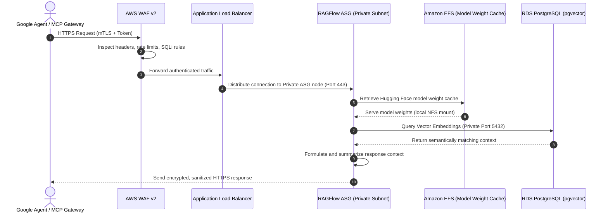

**[SECURITY & COMPLIANCE]**

# AI Agent Data Flow, EFS Model Caching, & Zero-Trust Security Handshake

This guide details how external AI agents (such as **Google Antigravity** and **Google Jules**) securely traverse our zero-trust AWS 3-Tier architecture in the **AWS Asia Pacific (Malaysia) Region (`ap-southeast-5`)** to retrieve context, query vector databases, and execute tasks without violating the **Malaysian Personal Data Protection Act (PDPA) 2010** or exposing internal system endpoints.

---

## 1. End-to-End Request Lifecycle & Network Path

When an external AI Agent or Model Context Protocol (MCP) gateway submits a "Knowledge-First Discovery" or "Context Query" request, it securely traverses a hardened Multi-AZ network topology.

The complete request lifecycle follows the path below:

$$\text{Google Agent / MCP Gateway} \longrightarrow \text{AWS WAF v2 / ALB} \longrightarrow \text{RAGFlow ASG (Private Subnet)} \longrightarrow \text{RDS PostgreSQL (pgvector) / EFS Model Cache}$$

### Sequence Flow of Agent Context Retrieval



---

## 2. EFS Workspace Model Caching & Performance Tuning

To optimize latency under high Virtual User (VU) loads, the **RAGFlow AI Tier** does not fetch heavy LLM/OCR model weights (such as Hugging Face layouts, tokenizers, or DeepDoc visual models) from the public internet during live queries. Instead, these weights are cached on shared **Amazon Elastic File System (EFS)** volumes.

### Mount Configuration & Mount Targets
Each private EC2 instance in the ASG automatically mounts the persistent EFS volume during bootstrapping. The recommended mount command ensures proper TCP window sizing and resilience:

```bash
mount -t nfs4 -o nfsvers=4.1,rsize=1048576,wsize=1048576,hard,timeo=600,retrans=2,noresvport fs-xxxxxx.efs.ap-southeast-5.amazonaws.com:/ /var/www/ragflow/models
```

### Performance Optimization Parameters
- **`open_file_cache` (Nginx):** Configured on the Nginx layer to cache EFS-mounted model descriptors, reducing EFS metadata lookup round-trips.
- **Provisioned Throughput:** For heavy AI agent queries, EFS is configured with **Provisioned Throughput** (e.g., 100 MiB/s baseline) rather than bursting, preventing performance degradation during high concurrent traffic.

---

## 3. Zero-Trust Security & IAM Handshake

The integration of external AI agents adheres strictly to zero-trust principles, guaranteeing that no external entities have direct access to internal subnets or raw database ports.

### IAM Roles & Instance Profiles
The RAGFlow ASG nodes operate on an IAM Instance Profile granting strictly scoped, temporary permissions:
```json
{
  "Version": "2012-10-17",
  "Statement": [
    {
      "Effect": "Allow",
      "Action": [
        "s3:GetObject",
        "s3:ListBucket"
      ],
      "Resource": [
        "arn:aws:s3:::secure-app-model-weights",
        "arn:aws:s3:::secure-app-model-weights/*"
      ]
    },
    {
      "Effect": "Allow",
      "Action": [
        "elasticfilesystem:ClientMount",
        "elasticfilesystem:ClientWrite"
      ],
      "Resource": "arn:aws:efs:ap-southeast-5:*:file-system/fs-******"
    }
  ]
}
```

### Mutual TLS (mTLS) & Agent Authentication
1. **mTLS Handshake:** The Application Load Balancer terminates mutual TLS using client certificates issued by our Private Certificate Authority (Private CA). External agent requests without a verified certificate are instantly rejected at the network boundary.
2. **MCP Proxy Security:** AI Agents communicate with the system using **Model Context Protocol (MCP)** via an AWS API Gateway MCP Proxy. This proxy translates Agent queries into specific REST APIs, preventing raw SQL/vector execution from outside the VPC.
3. **Database Port Isolation:** The security groups for RDS PostgreSQL (`pgvector`) allow ingress *exclusively* from the private application ASG security group on port `5432`. No external agent, gateway, or internet route can reach this port directly.

---

## 4. Malaysian Data Sovereignty Compliance

To comply with **PDPA 2010** and **PDPA (Amendment) Act 2024 (Section 129)**:
- **In-Region Boundary:** All user files, vector embeddings, and LLM processing nodes are restricted strictly to `ap-southeast-5`. No user PII or document text is exported cross-border for inference.
- **PII Scrubbing and Tokenization:** Before passing text to external AI agent APIs (such as external LLMs), private application nodes execute an automated tokenization pipeline, scrubbing identifying fields (names, NRIC numbers, phone numbers) and replacing them with temporary tokens.
- **Audit Trails:** Every Agent context request is fully logged with auditable metadata (Agent ID, timestamp, resource queried) and saved to encrypted CloudWatch Log Groups, meeting the mandatory Data Breach Notification requirements.
