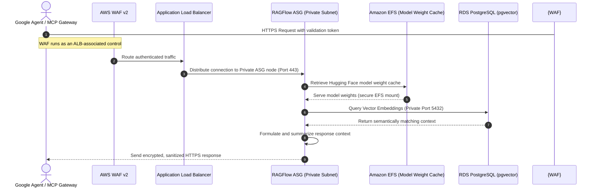

**[SECURITY & COMPLIANCE]**

# AI Agent Data Flow, EFS Model Caching, & Zero-Trust Security Handshake

This guide details how external AI agents (such as **Google Antigravity** and **Google Jules**) securely traverse our zero-trust AWS 3-Tier architecture in the **AWS Asia Pacific (Malaysia) Region (`ap-southeast-5`)** to retrieve context, query vector databases, and execute tasks. All processes are designed to support **Malaysian Personal Data Protection Act (PDPA) 2010 (Act 709)** compliance, contingent on server-side tokenization boundaries, secure tenant-level routing configurations, and the execution of specific sanitization workflows. It explicitly defines whether tokenized response context (classified as personal data under some configurations unless irreversibly anonymized with mapping destruction) is permitted to leave Malaysia to reach external AI recipient API boundaries.

---

## 1. End-to-End Request Lifecycle & Network Path

When an external AI Agent or Model Context Protocol (MCP) gateway submits a "Knowledge-First Discovery" or "Context Query" request, it securely traverses a hardened Multi-AZ network topology.

The complete request lifecycle follows the path below:

$$\text{Google Agent / MCP Gateway} \longrightarrow \text{AWS WAF v2 / ALB} \longrightarrow \text{RAGFlow ASG (Private Subnet)} \longrightarrow \text{RDS PostgreSQL (pgvector) / EFS Model Cache}$$

### Sequence Flow of Agent Context Retrieval



---

## 2. EFS Workspace Model Caching & Performance Tuning

To optimize latency under high Virtual User (VU) loads, the **RAGFlow AI Tier** does not fetch heavy LLM/OCR model weights (such as Hugging Face layouts, tokenizers, or DeepDoc visual models) from the public internet during live queries. Instead, these weights are cached on shared **Amazon Elastic File System (EFS)** volumes.

### Mount Configuration & Mount Targets
Each private EC2 instance in the ASG automatically mounts the persistent EFS volume during bootstrapping. Rather than a direct NFSv4.1 mount, instances utilize `amazon-efs-utils` with TLS and IAM authorization to secure the communication channel and preserve access profiles:

```bash
mount -t efs -o tls,iam fs-xxxxxx:/ /var/www/ragflow/models
```

### Performance Optimization Parameters
- **`open_file_cache` (Nginx):** Configured on the Nginx layer to cache EFS-mounted model descriptors, reducing EFS metadata lookup round-trips.
- **Provisioned Throughput:** For heavy AI agent queries, EFS is configured with **Provisioned Throughput** (e.g., 100 MiB/s baseline) rather than bursting, preventing performance degradation during high concurrent traffic.

---

## 3. Zero-Trust Security & IAM Handshake

The integration of external AI agents adheres strictly to zero-trust principles, guaranteeing that no external entities have direct access to internal subnets or raw database ports.

### IAM Roles & Instance Profiles
The RAGFlow ASG nodes operate on an IAM Instance Profile granting strictly scoped, temporary permissions:
```json
{
  "Version": "2012-10-17",
  "Statement": [
    {
      "Effect": "Allow",
      "Action": [
        "s3:GetObject",
        "s3:ListBucket"
      ],
      "Resource": [
        "arn:aws:s3:::secure-app-model-weights",
        "arn:aws:s3:::secure-app-model-weights/*"
      ]
    },
    {
      "Effect": "Allow",
      "Action": [
        "elasticfilesystem:ClientMount"
      ],
      "Resource": "arn:aws:elasticfilesystem:ap-southeast-5:123456789012:file-system/fs-0123456789abcdef0"
    }
  ]
}
```

*Note: Runtime writes are disabled on standard ASG compute nodes to enforce read-only cache isolation and prevent unauthorized modification of model weight cache folders. Cache population and updates are handled strictly via a separate administrative role or staging instance.*

### Authentication, Token Validation & Agent Protection

1. **Token Validation Handshake:** External agents pass a short-lived OAuth 2.0 validation token in the HTTP Authorization header. The RAGFlow application tier decodes and verifies this token against an internal JSON Web Token (JWT) validator.
2. **MCP Proxy Security:** External agents utilize a secured Model Context Protocol (MCP) gateway proxy. This gateway translates Agent requests into specific REST APIs, preventing direct raw SQL or vector execution outside the VPC boundary.
3. **Database Port Isolation:** The security groups for RDS PostgreSQL (`pgvector`) allow ingress *exclusively* from the private application ASG security group on port `5432`. No external agent, gateway, or internet route can reach this port directly.

---

## 4. Langfuse Tracing Contract

To ensure visibility and execution tracking of the AI Agent pipeline, the system is designed to integrate with a localized Langfuse deployment. The Langfuse tracing contract establishes the following security and operational controls:

- **Langfuse Tracing Component:** A dedicated monitoring tier is designed to record agent execution chains (token consumption, latency, routing steps).
- **Trace Propagation:** Context retrievals and LLM steps propagate telemetry metadata across API boundaries using the configured Langfuse SDK or OpenTelemetry propagation contract.
- **Authentication:** All telemetry payloads are transmitted securely over HTTPS using rotatable Basic Auth credentials (the public/private project keys `LANGFUSE_PUBLIC_KEY` and `LANGFUSE_SECRET_KEY`) rather than short-lived JWTs.
- **Retention:** Trace telemetry logs are retained for **30 days**, provided a configured Langfuse data retention policy is actively enforced.
- **PII Controls:** Payloads are pre-scrubbed at the application tier prior to telemetry dispatch. Highly sensitive identifiers are redacted, provided the application-tier tokenization pipeline is explicitly active and verified. TLS 1.3 encryption is leveraged if enforced by the target Langfuse endpoint listener.

---

## 5. Malaysian Data Sovereignty Compliance

Sovereignty in our layout is **designed to support PDPA compliance depending on server-side validation, secure tenant-level routing configuration, and standard operational processes** under **Section 129 of Act 709, as amended by the Personal Data Protection (Amendment) Act 2024 (Act A1727)**, which has its exact commencement date set as **April 1, 2025**:
- **In-Region Boundary:** All raw, unredacted user files, vector embeddings, and LLM processing nodes are restricted strictly to `ap-southeast-5`. No raw user PII or document text is exported cross-border for inference.
- **Section 129 Compliance Subsections:** Amended Subsection 129(2) governs cross-border transfers of personal data outside Malaysia, and Subsection 129(3) sets the applicable conditions by reference to Subsection 129(2):
  - **Subsection 129(3)(a):** The transfer is to a place that has in force a law substantially similar to Act 709, or that serves the same purposes as Act 709.
  - **Subsection 129(3)(b):** The transfer is necessary for the performance of a contract between the data subject and data user.
  - **Subsection 129(3)(e):** The data user has taken all reasonable precautions and exercised all due diligence to ensure that the personal data is protected against contraventions of Act 709.
- **Tokenized Context Classification:** While raw, unredacted citizen PII is strictly confined in-region, fully tokenized, sanitized, and anonymized response context is permitted to leave Malaysia to reach external AI recipient API boundaries.
- **PII Scrubbing and Sanitization Boundary:** Before passing text to external AI agent APIs, private application nodes execute an automated tokenization pipeline, scrubbing identifying fields (names, NRIC numbers, phone numbers) and replacing them with temporary tokens.

---

## 6. Security Governance & Audit Trails

### Operational Logging & Audit Trails
Every Agent context request is fully logged with operational metadata (Agent ID, timestamp, resource queried) and saved to encrypted CloudWatch Log Groups. These logs provide transaction visibility and tracing across private VPC routes.

### Breach Detection & Notification Framework (PDPA-Aligned)
- **Breach Detection:** Real-time GuardDuty and CloudWatch metrics alert operations teams of anomalous payload queries or data volume access (used strictly as detection controls, decoupled from the regulatory notification workflow).
- **Impact Assessment:** Detected anomalies and security incidents trigger a separate, manual/semi-automated harm-evaluation protocol to assess risk to data subjects.
- **Notification Controls:** Regulatory breach notifications are initiated and processed strictly in compliance with the official **Personal Data Protection Commissioner Circular No. 2/2025 on Data Breach Notification** (effective **1 June 2025**), specifying escalation to the Personal Data Protection Commissioner **within 72 hours** when significant harm to data subjects is likely. (Note: Circular No. 1/2025 is reserved exclusively for the appointment of a Data Protection Officer).
- **Retention & Access:** Logs and incident reports are kept in write-once-read-many (WORM) S3 Glacier vaults with a 7-year retention period, restricted solely to authorized compliance officers.

### Cross-Border Transfer Register (Authoritative)

Any data flowing outside `ap-southeast-5` is documented inside a secure, encrypted register. Because temporary tokenization does not constitute irreversible anonymization (the token-to-PII mapping exists database-side inside the VPC), all tokenized payloads are classified as **Personal Data** under Subsection 129 of Act 709.

The structural schema below constitutes our authoritative register of data classes, recipients, destinations, purposes, legal bases, approvals, notice/TIA evidence, and audit records, aligned with the AWS adoption roadmap:

| Receiver / Endpoint | Destination Country | Data Class / Classification | Purpose | Transfer Condition (Section 129 Basis) | Approvals, Notice/TIA Evidence, & Audit Record |
| :--- | :--- | :--- | :--- | :--- | :--- |
| **Enterprise CRM Sync** | Singapore (`ap-southeast-1`) | Personal Data (Tokenized CRM Metadata) | Customer database synchronization | Subsection 129(3)(b) (Contract Performance) | Board Approval 2025-A; Privacy Notice v3; TIA-CRM-2025; Audit Log ID: `tx_crm_sync` |
| **Notification Gateway** | Singapore (`ap-southeast-1`) | Personal Data (Tokenized Phone Identifiers) | Transactional SMS dispatch | Subsection 129(3)(b) (Contract Performance) | Board Approval 2025-B; User Consent Record; TIA-SMS-2025; Audit Log ID: `tx_sms_dispatch` |
| **Google Agent / MCP Gateway** | Singapore (`ap-southeast-1`) | Personal Data (Tokenized Response Context) | Context query summary generation | Subsection 129(3)(b) (Contract Performance) | Executive Committee Approval 2025-C; Dynamic User Consent; TIA-AI-2025; Audit Log ID: `tx_ai_context` |
| **Langfuse Monitoring** | Singapore (`ap-southeast-1`) | Personal Data (Tokenized Telemetry Metadata) | Trace monitoring and observability | Subsection 129(3)(e) (All Reasonable Precautions) | CIO Sign-off 2025-D; Privacy Notice v3; TIA-LANG-2025; Audit Log ID: `tx_lang_telemetry` |
