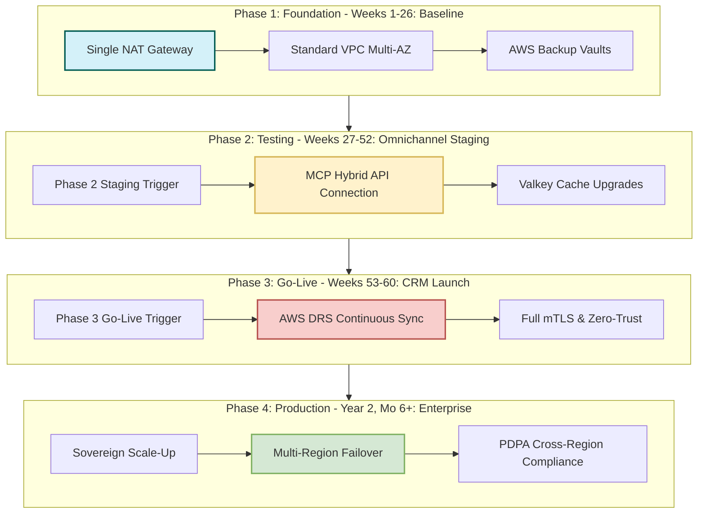

**[STRATEGIC FINANCIAL]**

# AWS Sovereign Infrastructure Adoption Roadmap & DR Maturation Timeline

This roadmap outlines the multi-phase deployment, network resiliency scaling, and disaster recovery (DR) maturation timeline for our secure 3-Tier Web Application inside the **AWS Asia Pacific (Malaysia) region (`ap-southeast-5`)**.

Crucially, this blueprint links financial costing projections and monthly run-rate increases to precise operational business milestones and legal sovereignty guidelines under the **Malaysian Personal Data Protection Act (PDPA) 2010** and the **2024 Amendment Act (Act A1727)**.

---

## 1. Executive Timeline & Strategic Business Milestones

To align project economics with business scaling, our AWS migration is structured as a 4-phase progressive model. Each transition points to clear chronological trigger gates.

```text
+-------------------------------------------------------------------------------------------------------+
|                                    AWS ADOPTION & DR MATURATION CURVE                                 |
+-------------------------------------------------------------------------------------------------------+
|                                                                                                       |
|  [PHASE 1: Baseline] ----------------> [PHASE 2: Staging] -----------> [PHASE 3: Go-Live] ------> [PHASE 4: Enterprise]
|  Weeks 1-26                            Weeks 27-52                      Weeks 53-60              Year 2, Mo 6+
|  - Cost: ~$141.47 USD/mo               - Cost: ~$418.60 USD/mo          - Cost: ~$898.54 USD/mo  - Cost: ~$1,037.73+ USD/mo
|  - DR: Backup/Restore                  - DR: Cold Standby/Pilot Light   - DR: AWS DRS Active     - DR: Multi-Region Active-Active
|  - Network: Single NAT / AZs           - Network: MCP Hybrid Staging    - Network: Full mTLS     - Network: Transit Gateway / VPN
|                                                                                                       |
+-------------------------------------------------------------------------------------------------------+
```

---

## 2. Chronological Sizing & Costing Roadmaps

### Phase 1: Foundation & Baseline Cost-Optimized Setup (Weeks 1–26)
* **Strategic Objective:** Establish secure core network foundation inside `ap-southeast-5`, deploy baseline compute layers, and verify zero-trust boundaries.
* **Chronological Timeline:** Weeks 1–26.
* **Operational Configuration:**
  - Standard multi-AZ networking (VPC public/private subnets) across `ap-southeast-5a` and `ap-southeast-5b`.
  - Computed ASG nodes (`t4g.micro`) in private subnets, fronted by Application Load Balancer and AWS WAFv2 regional protection.
  - Caching managed via Amazon ElastiCache for Valkey on `cache.t4g.micro` to support off-instance session scaling.
  - Multi-AZ RDS MariaDB baseline database instance.
* **Disaster Recovery Position:** Strategy A — Baseline Backup & Restore. Standard daily snapshot storage in isolated AWS Backup Vaults (in-region). RTO: 2-4 Hours; RPO: 24 Hours.
* **Financial Model Run-Rate:** **~$141.47 USD/mo** (RM 636.62 MYR/mo).

### Phase 2: Omnichannel Integration & CRM Staging Validation (Weeks 27–52)
* **Strategic Objective:** Integrate enterprise Omnichannel and CRM systems into the staging environment. Test hybrid API network connections under high workload patterns.
* **Chronological Timeline:** Weeks 27–52.
* **Operational Configuration:**
  - Upgrading compute instances to `t4g.medium` to support heavy processing workloads.
  - Caching upgraded to `cache.t4g.medium` to prevent bottlenecking during peak transaction surges.
  - **Upgrade Trigger (Week 27):** "Phase 2 Omnichannel Testing: Inject $15.00/mo Model Context Protocol (MCP) / API hybrid connection specifically for staging validation." This hybrid bridge establishes a secure, encrypted transit channel between AWS private subnets and our on-premises customer databases in Cyberjaya.
* **Disaster Recovery Position:** Strategy B — Pilot Light. Secondary standby database instances kept in a warm replication state; standby ASG sized at `desired_capacity = 0`. RTO: 15-30 Mins; RPO: Minutes.
* **Financial Model Run-Rate:** **~$418.60 USD/mo** (RM 1,883.70 MYR/mo).

### Phase 3: Omnichannel & CRM Go-Live & Active DR Maturation (Weeks 53–60)
* **Strategic Objective:** Move the Omnichannel CRM suite to active production status. Harden security controls to protect citizen data, and institute near-real-time disaster recovery.
* **Chronological Timeline:** Year 2, Months 1–2 (Weeks 53–60).
* **Operational Configuration:**
  - **Upgrade Trigger (Week 53):** "Year 2, Months 1–2 (Weeks 53–60): Omnichannel & CRM Go-Live triggers activation of AWS Elastic Disaster Recovery (AWS DRS) ($21.00/mo per server) to upgrade DR maturity from baseline backup/restore."
  - Low-cost `t3.small` replication instances and gp3 staging volumes continuously synchronize blocks asynchronously, ensuring near-zero data loss.
  - Enforce full mutual TLS (mTLS) handshake between the local application servers and public endpoints, passing through AWS WAFv2 filtering layers.
* **Disaster Recovery Position:** Strategy E — Continuous Block-Level Replication (AWS DRS). Continuous real-time block state tracking. RTO: < 15 Minutes; RPO: Seconds/Minutes.
* **Financial Model Run-Rate:** **~$898.54 USD/mo** (RM 4,043.43 MYR/mo) (Note: This is the non-DRS baseline subtotal. An active AWS DRS continuous replication adds ~$21.00 USD/mo per server for staging/gp3 replication disk usage under the following assumptions: 2 replication instances, gp3 replication storage, baseline workload retention, secure recovery, and zero egress cross-border data transfer costs).

### Phase 4: High-Performance Enterprise Sovereignty Scaling (Year 2, Month 6+)
* **Strategic Objective:** Maintain elite 10,000 VU high-concurrency availability with 9-ASG and 3-ALB network separation, enforcing absolute data sovereignty.
* **Chronological Timeline:** Year 2, Month 6 and onward (Week 78+).
* **Operational Configuration:**
  - Highly decoupled architecture featuring nine separate ASGs and three dedicated ALBs (Presentation, Application, and AI Agent layers).
  - AWS Transit Gateway manages high-bandwidth Hybrid IPSec VPN tunnels mapping back to our localized Cyberjaya datacenters.
  - Absolute data residency compliance pinned to the local `ap-southeast-5` region. Multi-AZ database instances promoted to large scale (`db.m6g.xlarge` or `db.m7g.2xlarge`).
* **Disaster Recovery Position:** Strategy C/D — Multi-Region Deployment with Aurora Global Database.
  - **Deployable Topology:** One single writer located in primary region `ap-southeast-5` (Malaysia), with continuous asynchronous replication to a read-only secondary instance in `ap-southeast-1` (Singapore) as the approved failover target.
  - **Permitted Data Classes:** Personal Data (Tokenized CRM Metadata, Tokenized Phone Identifiers, Tokenized Response Context, and Tokenized Telemetry Metadata) and anonymized system metrics are permitted to be transferred cross-border. No raw, unencrypted PII is allowed outside Malaysia.
  - **Cross-Border Approvals:** Explicitly restricted to validated destinations carrying a TIA clearance.
  - **Measured Performance Targets:** Non-zero Recovery Point Objective (RPO) of < 1 second of asynchronous replication lag and a Recovery Time Objective (RTO) of < 15 minutes (allowing for automatic/manual Route 53 DNS routing failover and secondary database writer promotion).
* **Financial Model Run-Rate:** **~$1,037.73 USD/mo** (RM 4,669.78 MYR/mo) to **~$3,808.88 USD/mo** (RM 17,139.96 MYR/mo) based on concurrency tiers.

---

## 3. Visual Evolution Curve & Network Resiliency

This diagram depicts the 4-phase maturity curve for network resiliency, DR capabilities, and compliance depth.



---

## 4. PDPA Sovereignty & Compliance Decision Gates

Deploying in `ap-southeast-5` addresses localized residency, but Cross-Region Disaster Recovery requires strategic compliance with **PDPA Section 129**:
1. **Transfer Impact Assessment (TIA):** Before replicating any citizen PII data outside of Malaysia (e.g., to Singapore `ap-southeast-1` as the secondary disaster recovery standby region), a TIA must be formally conducted.
2. **KMS Cryptographic Isolation:** Ensure all data replicated cross-region is fully encrypted at-rest using localized KMS keys where administrative access is strictly segregated.
3. **Alternative Compliance Bases:** Standard contractual clauses (SCCs) are managed server-side. The system implements robust server-side transfer policy enforcement with consent records, recipient validation, and detailed audit evidence. This replaces client-side frontend routing rules, keeping database transaction layers separate from the presentation UI.
